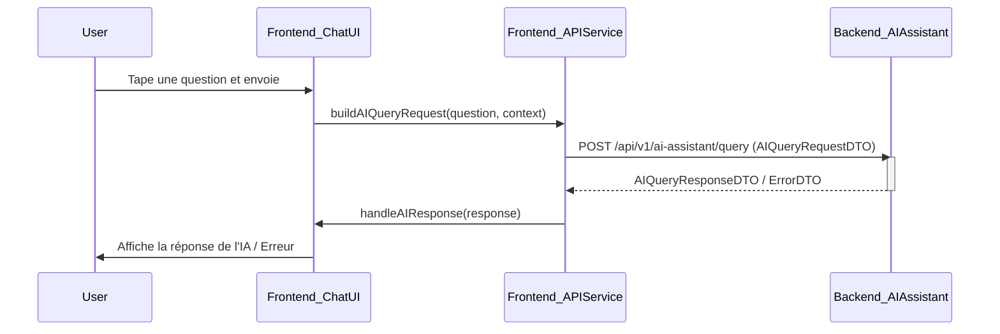

# P2-L2 M4: AI Config Assistant - Frontend Integration Design

Ce document détaille la conception de l'intégration frontend pour l'assistant IA de BlockDeploy, dans le cadre de la Milestone 4 (M4) du Lot P2-L2. L'objectif est de planifier comment l'assistant sera présenté et interagira avec l'utilisateur au sein de l'interface BlockDeploy.

Ce document s'appuie sur les réflexions initiales de `P2_L2_M1_IA_ASSISTANT_UI_UX.md` et les affine.

## 1. Objectifs de l'Intégration Frontend

- **Accessibilité:** L'assistant doit être facilement accessible sans être intrusif.
- **Clarté:** Les interactions et les informations fournies par l'assistant doivent être claires et compréhensibles.
- **Réactivité:** L'interface doit fournir un feedback immédiat sur les actions de l'utilisateur et l'état de l'assistant.
- **Cohérence:** L'apparence et le comportement de l'assistant doivent être cohérents avec le reste de l'interface BlockDeploy.
- **Utilité Contextuelle:** L'assistant devrait, autant que possible, être conscient du contexte de l'utilisateur dans l'application.

## 2. UI/UX du Composant Assistant IA

Après analyse des options envisagées en M1 (panneau latéral, modale, intégration contextuelle), nous optons pour une approche hybride :

- **Point d'entrée principal:** Un **panneau latéral de chat flottant et rétractable**, accessible via une icône persistante (ex: en bas à droite de l'écran). Cela offre une accessibilité constante sans masquer le contenu principal.
- **Points d'aide contextuels:** Des icônes "Aide IA" discrètes à côté de certains champs de configuration complexes ou de sections spécifiques, qui, au clic, pourraient soit ouvrir le panneau latéral en y injectant un contexte, soit afficher une info-bulle avec une suggestion rapide de l'IA.

### 2.1. Panneau Latéral de Chat (Principal)

- **Apparence:**
    - Design moderne et épuré, aligné avec la charte graphique de BlockDeploy.
    - Hauteur et largeur ajustables par l'utilisateur (dans certaines limites) ou fixes mais optimisées.
    - En-tête avec le nom "Assistant IA BlockDeploy" et des actions (ex: effacer la conversation, fermer le panneau).
- **Contenu:**
    - Zone d'affichage des messages (utilisateur et IA).
    - Champ de saisie pour la requête utilisateur, avec un bouton d'envoi.
    - Possibilité d'inclure des boutons pour des actions fréquentes (ex: "Suggérer une config pour un nouveau projet", "Analyser ma config actuelle").
- **Comportement:**
    - Rétractable pour minimiser l'encombrement.
    - Mémorisation de l'état ouvert/fermé.
    - Notification discrète sur l'icône si l'IA a une nouvelle réponse et que le panneau est fermé.

**Wireframe Conceptuel (Rappel M1 avec précisions):**
```
+---------------------------------+
|      Assistant IA BlockDeploy  [X] |  <- En-tête avec titre et bouton fermer
+---------------------------------+
| [IA] Bonjour ! Comment puis-je  |  <- Zone de messages
| vous aider aujourd'hui ?        |
|                                 |
| [User] Je veux déployer un      |
| contrat ERC20.                  |
|                                 |
| [IA] Parfait, sur quelle        |
| blockchain ? (Ethereum, Polygon?)|
|  [Suggestions: Ethereum]        |  <- Boutons de suggestion rapide
|  [Suggestions: Polygon]         |
|                                 |
|                                 |
+---------------------------------+
| [___________________________] [>] |  <- Champ de saisie et bouton envoi
| [Analyser ma config] [Nouveau projet] | <- Actions rapides
+---------------------------------+
```

### 2.2. Aide Contextuelle

- **Apparence:** Petite icône "?" ou "💡" à côté des champs ou sections concernés.
- **Comportement:**
    - Au survol: Affiche une info-bulle avec une brève description de l'aide que l'IA peut apporter.
    - Au clic:
        - Option A: Ouvre le panneau latéral de chat et pré-remplit une question relative au contexte. (Ex: "Explique-moi l'option 'Sharding' pour ma base de données").
        - Option B (pour des aides simples): Affiche une modale ou une pop-over avec une explication concise ou une suggestion directement issue de l'IA, sans ouvrir le chat complet.

## 3. Flux d’Intégration avec l’API Backend

Le frontend interagira principalement avec l'endpoint `/api/v1/ai-assistant/query` défini dans `P2_L2_M2_AI_BACKEND_DESIGN.md`.

### 3.1. Envoi d'une Requête Utilisateur

1.  **Collecte de l'entrée:** L'utilisateur tape sa question dans le champ de saisie du panneau de chat ou clique sur un point d'aide contextuel.
2.  **Construction de la requête frontend:**
    - Le texte de l'utilisateur est récupéré.
    - Le frontend collecte les informations contextuelles pertinentes :
        - `user_id` (depuis la session d'authentification).
        - `conversation_id` (généré par le client pour la première requête d'une session de chat, ou réutilisé).
        - Contexte spécifique à la page/vue actuelle (ex: `deployment_id`, `project_name`, contenu d'un formulaire de configuration si l'utilisateur demande une analyse).
        - `ui_location` (chaîne décrivant la page/section actuelle).
3.  **Appel API:**
    - Le frontend envoie une requête `POST` à `/api/v1/ai-assistant/query` avec le `AIQueryRequestDTO` construit.
    - Le header `Authorization` (Bearer token) est inclus pour l'authentification.
4.  **Gestion de l'état "en attente":** Le frontend affiche un indicateur de chargement (voir section 4).

### 3.2. Réception et Affichage de la Réponse

1.  **Réception de la réponse:** Le frontend reçoit le `AIQueryResponseDTO` ou un `ErrorDTO` du backend.
2.  **Traitement de la réponse (succès):**
    - Le `conversation_id` est stocké/mis à jour.
    - La `text_response` de l'IA est affichée dans la zone de chat.
    - Les `structured_data` sont parsées et affichées de manière appropriée:
        - Blocs de code (avec coloration syntaxique et bouton "copier").
        - Suggestions de configuration (peuvent être présentées sous forme de diff, ou avec des boutons pour appliquer).
        - Listes, tableaux.
    - Les `sources` (pour RAG) peuvent être affichées sous forme de liens ou de références.
3.  **Traitement de la réponse (erreur):**
    - Un message d'erreur clair est affiché à l'utilisateur (voir section 4).
    - L'erreur est logguée côté client (console, ou système de monitoring frontend).

### 3.3. Diagramme de Flux Simplifié



## 4. Éléments Visuels de Feedback

Un feedback clair est essentiel pour une bonne UX.

### 4.1. États de Chargement (Loading)

- **Pendant l'appel API:**
    - Le bouton "Envoyer" de la zone de saisie peut être désactivé et afficher un spinner.
    - Un message temporaire "L'assistant réfléchit..." peut apparaître dans la zone de chat.
    - Si l'IA "tape" sa réponse (streaming), un indicateur de frappe (comme trois points animés) peut être affiché.
- **Pour les actions longues (ex: application d'une suggestion de config):**
    - Indicateur de progression global si applicable, ou spinner sur l'élément concerné.

### 4.2. Affichage des Erreurs

- **Erreurs d'API (connexion, serveur):**
    - Message générique mais clair dans le chat: "Désolé, une erreur est survenue. Veuillez réessayer plus tard."
    - Toast/Notification non intrusive en haut/bas de l'écran.
- **Erreurs de validation (4xx):**
    - Message spécifique si possible: "Votre question est trop courte." ou "Le format de la configuration fournie est incorrect."
- **Erreurs du LLM (contenu filtré, refus de répondre):**
    - Message adapté: "L'assistant ne peut pas répondre à cette demande spécifique." ou "Une partie de la réponse a été modérée."
- **Design des messages d'erreur:** Doivent être clairement identifiables (ex: couleur rouge, icône d'erreur) mais pas alarmistes.

### 4.3. Affichage des Suggestions

- **Texte:** Réponse textuelle principale de l'IA.
- **Code/Configuration:**
    - Blocs de code avec coloration syntaxique.
    - Bouton "Copier" pour chaque bloc.
    - Pour les suggestions de configuration modifiant une existante, un affichage "diff" (avant/après) serait idéal.
    - Boutons d'action contextuels: "Appliquer cette suggestion", "En savoir plus".
- **Listes/Tableaux:** Formatage clair et lisible.
- **Sources:** Liens cliquables si des URLs sont fournies.

### 4.4. Feedback Positif / Succès

- Confirmation visuelle discrète quand une action est complétée (ex: "Configuration appliquée avec succès").

## 5. Gestion de l’Historique de Discussion

L'historique est important pour que l'utilisateur puisse reprendre une conversation et pour que l'IA maintienne le contexte.

### 5.1. Stockage Côté Client

- **Option 1: `localStorage` ou `sessionStorage`**
    - Simple à implémenter.
    - `sessionStorage`: L'historique persiste pour la durée de la session du navigateur (onglet).
    - `localStorage`: L'historique persiste jusqu'à ce qu'il soit effacé manuellement ou par le code.
    - Limites de taille à considérer.
- **Option 2: IndexedDB**
    - Plus robuste pour de grandes quantités de données.
    - Plus complexe à mettre en œuvre.
- **Ce qui est stocké:** Un tableau d'objets, chaque objet représentant un message (auteur: 'user'/'ia', contenu, timestamp, type de contenu: 'text'/'code'/'suggestion').
- **Format:**
  ```json
  [
    { "id": "msg1", "author": "ia", "text": "Bonjour !", "timestamp": "..." },
    { "id": "msg2", "author": "user", "text": "Question ?", "timestamp": "..." },
    { "id": "msg3", "author": "ia", "text": "Réponse.", "structured_data": { ... }, "timestamp": "..." }
  ]
  ```

### 5.2. Affichage de l'Historique

- Le panneau de chat affiche les messages précédents au fur et à mesure que l'utilisateur scrolle vers le haut.
- Chargement paresseux (lazy loading) de l'historique si celui-ci devient très long pour ne pas impacter les performances.

### 5.3. Gestion du Contexte Conversationnel

- Pour chaque nouvelle requête, le frontend pourrait envoyer les N derniers messages (ou un résumé) au backend dans le champ `context.conversation_history` du `AIQueryRequestDTO`. Le backend (ou le LLM) utilisera cet historique pour maintenir le fil de la discussion.
- Un bouton "Nouvelle Conversation" ou "Effacer l'historique" permettra à l'utilisateur de réinitialiser le contexte.

### 5.4. Synchronisation Multi-Appareils (Post M4 - Optionnel Avancé)

- Si l'historique doit être partagé entre plusieurs appareils ou sessions, il faudrait le stocker côté serveur (associé au `user_id`). Cela nécessiterait des endpoints API backend supplémentaires (ex: `GET /history/{conversation_id}`, `POST /history`). Pour M4, nous nous concentrons sur un historique local au client.

## 6. Accessibilité (a11y)

- S'assurer que tous les composants de l'assistant IA sont accessibles au clavier.
- Utiliser les attributs ARIA appropriés pour les lecteurs d'écran.
- Contraste des couleurs suffisant.
- Textes alternatifs pour les icônes.

## 7. Technologies Frontend Envisagées

- **Framework:** S'intégrer au framework frontend existant de BlockDeploy (React, Vue, Angular, etc.).
- **Gestion d'état:** Utiliser la solution de gestion d'état en place (Redux, Vuex, Zustand, Context API) pour gérer l'état du chat (messages, état de chargement, erreurs).
- **Bibliothèques Utiles (exemples):**
    - Pour la coloration syntaxique: `highlight.js`, `prism.js`.
    - Pour le rendu Markdown (si l'IA répond en Markdown): `marked.js`, `react-markdown`.

Ce document servira de guide pour l'implémentation frontend de l'assistant IA. Des maquettes plus détaillées et des prototypes interactifs seront développés sur cette base.
